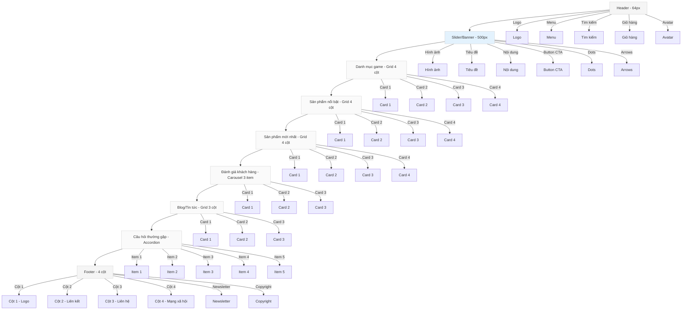

# Thiết kế giao diện UI/UX cho trang chủ website bán acc

## 1. Yêu cầu UI/UX

- **Phong cách**: Hiện đại, tối giản (minimalist)
- **Màu sắc**: Tone sáng (trắng, xám nhạt, xanh dương)
- **Font chữ**: Đẹp, dễ đọc (giống iOS hoặc Material Design 3)
- **Khoảng trắng**: Hợp lý, spacing đều, bo góc nhẹ
- **Thành phần UI**: Card, Chip, Button, TextField hài hòa, đẹp mắt
- **Trạng thái**: Hiển thị bằng chip màu chuyên nghiệp
- **Đường viền**: Hạn chế, ưu tiên shadow nhẹ, phân lớp qua màu nền

## 2. Hệ thống thiết kế (Design System)

### 2.1. Bảng màu

| Màu | Mã hex | Sử dụng |
|-----|--------|---------|
| Trắng | #FFFFFF | Nền chính |
| Xám nhạt | #F5F5F5 | Nền phụ |
| Xanh dương | #2196F3 | Màu chủ đạo |
| Xám | #757575 | Text phụ |
| Đen | #2121 | Text chính |
| Xanh lá | #4CAF50 | Chip Paid |
| Xám đậm | #9E9E9E | Chip Unpaid |
| Đỏ nhạt | #FFCDD2 | Chip Overdue |
| Đỏ đậm | #B71C1C | Text Overdue |

### 2.2. Font chữ

- **Font family**: -apple-system, BlinkMacSystemFont, 'Segoe UI', Roboto, sans-serif
- **Font size**: 
  - Tiêu đề lớn: 32px-48px
  - Tiêu đề: 20px-24px
  - Nội dung: 14px-16px
  - Phụ: 12px-14px

### 2.3. Bo góc và shadow

- **Bo góc**: 4px-8px cho thành phần, 12px cho chip
- **Shadow**: box-shadow: 0 1px 3px rgba(0,0,0,0.12), 0 1px 2px rgba(0,0,0,0.24)

### 2.4. Spacing

- Sử dụng hệ thống 4px, 8px, 12px, 16px, 24px, 32px

### 2.5. Các thành phần UI

#### Button
```css
button {
  padding: 8px 16px;
  border-radius: 4px;
  font-weight: 500;
  background-color: #2196F3;
  color: white;
  border: none;
  cursor: pointer;
  transition: box-shadow 0.2s;
}

button:hover {
  box-shadow: 0 2px 4px rgba(0,0,0.16);
}
```

#### Chip
```css
.chip {
  padding: 4px 8px;
  border-radius: 12px;
  font-size: 12px;
  display: inline-block;
}

.chip.paid {
  background-color: #4CAF50;
  color: white;
}

.chip.unpaid {
  background-color: #9E9E9E;
  color: white;
}

.chip.overdue {
  background-color: #FFCDD2;
  color: #B71C1C;
}
```

#### TextField
```css
input {
  padding: 8px 12px;
  border-radius: 4px;
  border: 1px solid #E0E0E0;
  transition: border-color 0.2s;
}

input:focus {
  border-color: #2196F3;
  outline: none;
}
```

#### Card
```css
.card {
  padding: 16px;
  border-radius: 8px;
  box-shadow: 0 1px 3px rgba(0,0,0,0.12);
  background-color: white;
  margin: 16px;
}
```

## 3. Thiết kế chi tiết từng component

### 3.1. Header

- **Chiều cao**: 64px
- **Logo**: Bên trái
- **Menu**: Ở giữa
- **Tìm kiếm, giỏ hàng, avatar**: Bên phải
- **Shadow**: Dưới bottom

### 3.2. Slider/Banner

- **Chiều cao**: 500px (desktop), 300px (mobile)
- **Hình ảnh**: Full-width, object-fit cover
- **Overlay**: Gradient đen ở bottom
- **Content**: Căn giữa dọc, text trắng
- **Button CTA**: Xanh dương, bo góc, shadow nhẹ
- **Dots indicator**: Tròn, trắng 50% opacity, active 100%
- **Navigation arrows**: 2 bên, icon trắng

### 3.3. Danh mục game

- **Grid**: 4 cột (desktop), 2 cột (tablet), 1 cột (mobile)
- **Card**: Padding 16px, bo góc 8px, shadow nhẹ
- **Hình ảnh**: Aspect ratio 16:9, object-fit cover
- **Tên**: Căn giữa, bold
- **Hover**: Shadow tăng nhẹ, scale 1.02

### 3.4. Sản phẩm nổi bật/mới nhất

- **Grid**: 4 cột (desktop), 2 cột (tablet), 1 cột (mobile)
- **Card**: Padding 16px, bo góc 8px, shadow nhẹ
- **Hình ảnh**: Aspect ratio 1:1, object-fit cover
- **Tên**: Bold
- **Giá**: Bold, màu xanh dương
- **Rating**: Icon sao vàng
- **Button**: Xanh dương, text trắng, bo góc

### 3.5. Đánh giá khách hàng

- **Carousel/Grid**: 3 cột
- **Card**: Padding 24px, bo góc 8px, shadow nhẹ
- **Avatar**: Hình tròn, 48px
- **Rating**: Icon sao vàng
- **Quote**: Góc trên phải
- **Hover**: Shadow tăng nhẹ

### 3.6. Blog/Tin tức

- **Grid**: 3 cột (desktop), 2 cột (tablet), 1 cột (mobile)
- **Card**: Padding 16px, bo góc 8px, shadow nhẹ
- **Thumbnail**: Aspect ratio 16:9, object-fit cover
- **Tiêu đề**: Bold
- **Trích dẫn**: Line-height 1.5
- **Ngày**: Font nhỏ, màu xám

### 3.7. Câu hỏi thường gặp

- **Accordion**: Tiêu đề + nội dung
- **Tiêu đề**: Padding 16px, background xám nhạt, bold
- **Icon +/-**: Bên phải tiêu đề
- **Nội dung**: Padding 16px, background trắng
- **Border**: Bottom giữa các item

### 3.8. Footer

- **Cột**: 4 cột (desktop)
- **Padding**: 32px
- **Background**: Xám nhạt
- **Liên kết**: Hover underline
- **Newsletter**: TextField + Button
- **Copyright**: Căn giữa, font nhỏ

## 4. Mockup trang chủ



## 5. Responsive design

- **Desktop (>1024px)**: 4 cột cho grid
- **Tablet (768px-1024px)**: 2 cột cho grid
- **Mobile (<768px)**: 1 cột cho grid
- **Header**: Hamburger menu trên mobile
- **Slider**: Height giảm trên mobile
- **Font size**: Giảm 2px trên mobile
- **Padding/Spacing**: Giảm 50% trên mobile